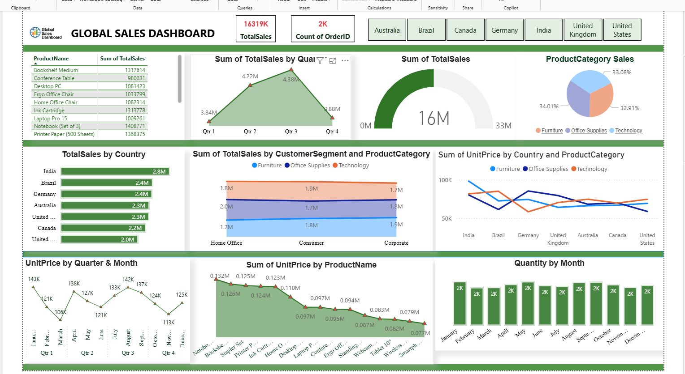

cat << 'EOF' > README.md
# 📊 Global Sales Dashboard – Power BI

A fully interactive **Power BI dashboard** designed to analyze global sales performance across countries, customers, product categories, revenue segments, and time periods.  
The dashboard provides **deep insights**, including monthly trends, profitability, customer segmentation, product performance, and dynamic visuals for decision-making.

---

## 📑 Table of Contents
- [Project Overview](#project-overview)
- [Tools & Technologies Used](#tools--technologies-used)
- [Key Dashboard Features](#key-dashboard-features)
- [Top 5 Product Insights](#top-5-product-insights)
- [Customer Segment vs Product Category](#customer-segment-vs-product-category)
- [Product Performance](#product-performance)
- [Quantity Overview](#quantity-overview)
- [Dashboard Preview](#dashboard-preview)
- [DAX Measures Used](#dax-measures-used)
- [Contact](#contact)

---

## 🚀 Project Overview
This Power BI project analyzes a **comprehensive global sales dataset**, enabling users to:

- Track **Total Sales**, **Order Count**, and **Top Products**
- Analyze sales by **Country**, **Customer Segment**, and **Product Category**
- View **monthly and yearly trends**
- Compare **Line Chart visuals** (Month vs Segment, Segment vs Region)
- Explore **Product-wise sales insights** using dynamic interactive charts
- Monitor sales distributions using **bar charts, KPIs, gauges, and slicers**

---

## 🛠️ Tools & Technologies Used
- **Power BI**
- **Power Query**
- **DAX (Data Analysis Expressions)**
- **Data Modeling**
- **Excel / CSV (Source Data)**

---

## ⭐ Key Dashboard Features
- **Total Sales**
- **Total Quantity**
- **Order Count**
- **Customer Segmentation**
- **Dynamic Trend Comparison**
- **Interactive Filters (Country, Product Category, Segment)**

---

## 🥇 Top 5 Product Insights
- Top 5 products by **Sales Analysis**
- Top products **by Country**
- Performance comparison using **KPI cards & bar charts**

---

## 👥 Customer Segment vs Product Category
- Segmented view based on:
  - Pricing insights  
  - Region-wise performance  
  - Customer purchase behavior  
- Includes **line chart** & **donut charts** by category and region

---

## 📦 Product Performance
- Product-wise sales contribution  
- Category-wise distribution  
- Sales & profit trend comparison  
- Interactive charts for deeper analysis  

---

## 📈 Quantity Overview
- Monthly order quantity breakdown  
- Category-wise contribution  
- Comparative quantity charts

---

## 🖼️ Dashboard Preview




---

## 🔢 DAX Measures Used
```DAX
-- Total Sales
Total Sales = SUM(Sales[SalesAmount])

-- Order Count
Order Count = DISTINCTCOUNT(Sales[OrderID])

-- Average Unit Price
Average Unit Price = AVERAGE(Sales[UnitPrice])

-- Total Quantity
Total Quantity = SUM(Sales[Quantity])


📬 Contact

If you'd like to learn more or collaborate, feel free to reach out:

📧 Email: sawmar044@gmail.com

🔗 LinkedIn: https://www.linkedin.com/in/balram-shah